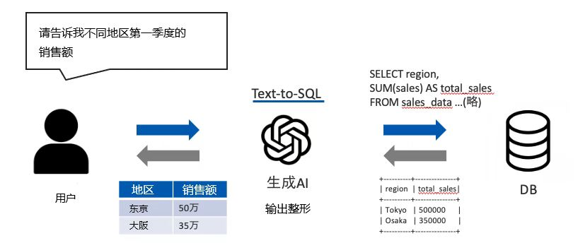
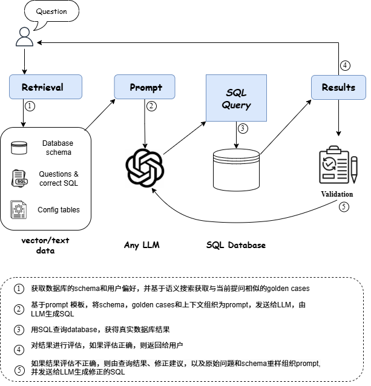

# Zebura - 使用自然语言做数据分析，轻松获得业务洞察  

## 产品简介  
**zebura** 是一款无技术门槛的数据分析工具，它采用了基于大语言模型的自然语言转SQL技术，普通用户能够通过自然语言查询实时业务数据，获取可操作的洞察。 用户不需要 SQL 编程的专业知识，从根本上解决了普通用户做数据分析的困难。 
通过Zebura提供的对话式数据分析技术，企业用户有望全面升级获取和分析数据的方式，轻松挖掘业务数据中蕴含着知识和决策的见解，推动企业在当今的答案经济（Answer Economy）中取得成功。

使用zebura的数据分析的过程

## 主要特点  
- **自然语言查询**：用户可直接用自然语言提问，Zebura 自动解析并执行数据查询任务。  
- **只需数据库的模式信息**：Zebura 不需要额外的训练过程，借助LLM的自然语言理解能力，可以冷启动将自然语言问题解析为符合用户数据库模式（schema）的SQL语句。  
- **自动生成数据库说明文档和查询示例**：真实企业的数据库往往内容庞杂，表和字段都鲜有说明，不利于用户利用数据资源。 zebura可以自动对数据表进行梳理分类，生成表和字段的说明文档，还可生成查询示例。 生成的数据库的说明文档可供用户编辑。 用户可以对企业特有的字段做进一步的解释说明，补充zebura欠缺的行业知识，提升SQL转化准确率。  
- **查询修正**：自然语言存在歧义，用户的问题可能包含模糊表达，或者不具有准确的数据库值，因此一次性生成正确的SQL是非常具有挑战性。 zebura通过考虑查询数据库的真实结果，并结合上下文和领域知识， 能够对生成的SQL语句进行验证并优化有缺陷的 SQL，进一步提升SQL执行的准确率。  
- **支持多表**：支持数据表众多的场景，可支持超过1000张数据库表。
- **多语言和跨语言**：用户查询语言可以与数据库中数据所用语言不一样， 支持多语言，跨语言查询。
- **多轮对话**：通过多轮对话引导用户明确需求，更好地理解用户查询背后的意图。

- demo：[www.zebura.com](http://ai.talqee.com:8081/)  

---

**Zebura，轻松解锁数据智能！**

